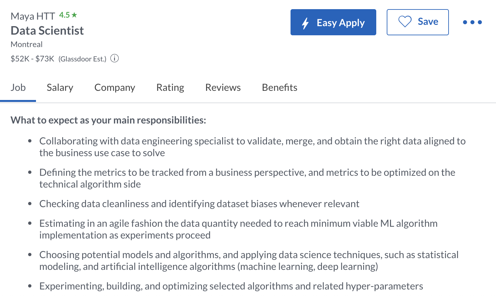

# Task 1: Data Science Careers

I picked three data science-related jobs that look appealing. The companies are Brain Finance, Deloitte and Maya. They all provide the opportunities to collaborate with experienced data engineering specialists to work on databases and develop the analytical skills to obtain information needed. It would align to the business use cases and help customers with their needs. I think it will be helpful and interesting.

# Task 2: Highs and Lows

-I appreciate that we had the chance to explore different data science tools!
-I didn't really like the manual annotation parts :p
-It let me know more about how to deal with data. I will definitely consider related jobs in the future!

Thank you prof and TAs. It is a great course, I'm happy to take it! Take care <3